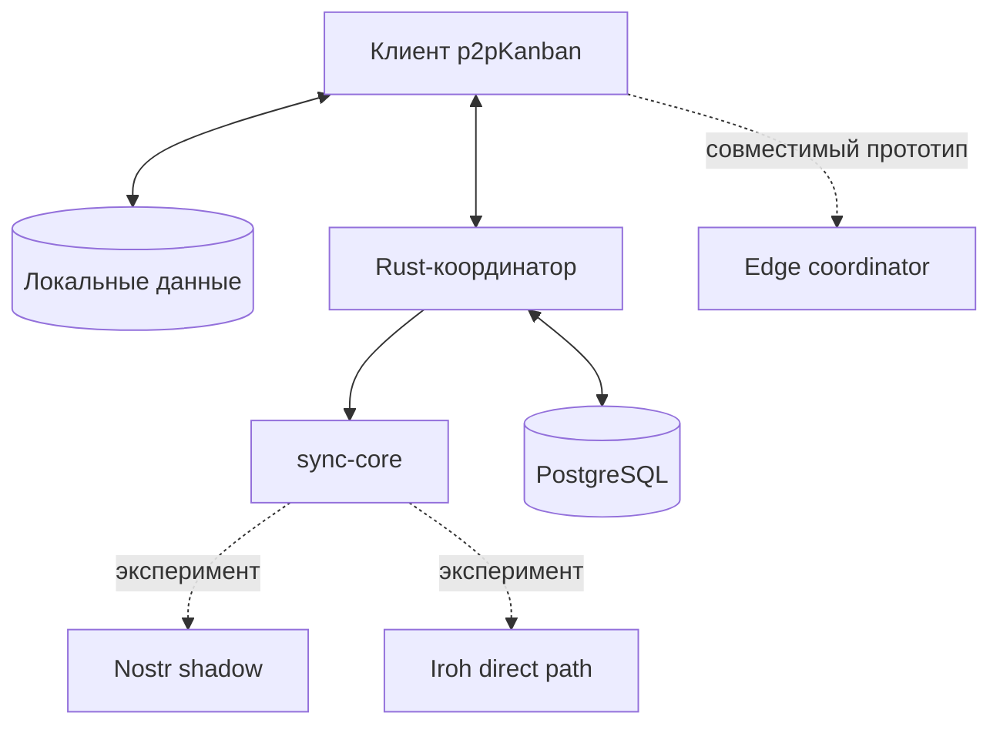

# ADR-006: транспортный стек «бездомной доски»

- Статус: принято как экспериментальное направление
- Дата актуализации: 2026-07-25

## Контекст

Полностью прямой P2P-обмен не решает доставку между участниками, которые не
бывают онлайн одновременно. Один бесплатный VPS решает эту задачу, но снова
делает проект зависимым от постоянного сервера, тарифа и конкретного
провайдера.

Текущая реализация уже имеет полезные заготовки:

- локальный snapshot;
- очередь исходящих операций;
- `replicaId`, `replicaSeq`, `logicalClock`;
- event log, cursor, tombstones и `serverOrder`;
- backend, который проверяет права и принимает изменения.

При этом coordinator-free модель прав ещё не реализована. Поэтому транспорт
можно менять постепенно, не выдавая эксперимент за готовую P2P-систему.

## Решение

Выбрана составная модель:

1. Rust/PostgreSQL backend остаётся каноническим координатором текущей beta.
2. `sync-core` хранит нейтральный к транспорту контракт событий и merge-правила.
3. Nostr используется как зашифрованное асинхронное зеркало accepted events.
4. Iroh используется как прямой быстрый путь между одновременно доступными
   native peers.
5. Cloudflare Durable Object исследуется как небольшой совместимый координатор
   для membership, dedupe, cursor, `serverOrder` и WebSocket.
6. Домашний coordinator через Tailscale остаётся самым простым бесплатным
   способом совместной работы на текущем коде.

## Инварианты

- Сбой Nostr/Iroh не должен откатывать уже принятую пользовательскую операцию.
- Одна операция имеет один `eventId` и дедуплицируется независимо от транспорта.
- Transport не выбирает смыслового победителя конфликта.
- Секреты workspace не попадают в Git, manifest, URL и логи.
- Внешний relay не видит открытый payload и настоящий workspace UUID.
- `serverOrder` остаётся порядком принятия/доставки, а не универсальным правилом
  смыслового разрешения конфликтов.
- Coordinator-free режим нельзя включать до подписей устройств и
  owner-signed membership epochs.

## Последствия

Плюсы:

- бесплатные сервисы становятся сменяемыми перевозчиками;
- исчезновение одного relay не уничтожает доску;
- текущий backend не требуется переписывать сразу;
- transport можно проверять в shadow-режиме.

Минусы:

- временно существуют несколько путей доставки;
- ключи, ротация и наблюдаемость усложняются;
- browser не может напрямую использовать native Iroh endpoint;
- полное восстановление из relay должно быть отдельно доказано;
- edge coordinator пока слабее основного backend по авторизации.

## Критерий перехода дальше

Nostr можно считать восстановительным транспортом только после успешного
восстановления тестовой доски из relay events в пустую проекцию. Edge
coordinator может заменить Rust-координатор только после подписей каждого
события, ротации membership epochs и отрицательных auth-тестов.

