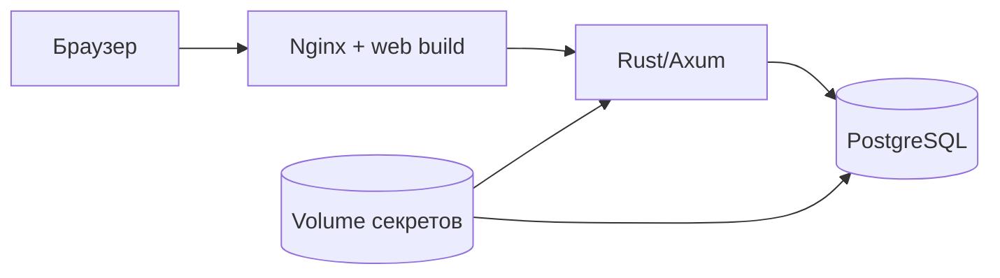

# Развёртывание и упаковка v1

- Статус: актуализировано для `v1.0.0-beta.3`
- Основной пользовательский путь: zero-config Docker bootstrap

## Текущая схема



В обычном режиме наружу публикуется только web-порт. Backend и PostgreSQL
находятся во внутренней Docker-сети.

## Профили

### Обычный self-host

```bash
python bootstrap.py
```

Wrapper выбирает порт, проверяет Docker, создаёт секреты, запускает Compose,
ждёт health endpoint и открывает браузер.

На хосте не нужны Rust, Node.js, PostgreSQL и ручной `.env`.

### Разработка

Host-native путь сохраняется для быстрой итерации:

```bash
python tools/devbootstrap.py diagnose --no-write-report
cd backend && cargo run --bin p2p-planner-backend
cd frontend && npm ci && npm run dev
```

Здесь разработчик сознательно управляет локальными зависимостями и БД.

### Домашний общий coordinator

`deploy/home-coordinator` запускает backend/PostgreSQL на Linux-машине и
показывает API через Tailscale HTTPS. Это текущий практический путь для
нескольких удалённых участников.

### Экспериментальные транспорты

Nostr, Iroh и edge coordinator поставляются отдельно и не включаются
автоматически. Они не должны влиять на доступность обычного Compose stack.

## Deployment units

| Unit | Обязанность | Поставка |
|---|---|---|
| `web` | Статика React/Vite и reverse proxy `/api` | Nginx container |
| `backend` | HTTP API, auth, домен, sync coordinator | Один Rust binary внутри container |
| `postgres` | Каноническое серверное состояние | Официальный PostgreSQL container |
| `bootstrap-init` | Первичная генерация секретов | Одноразовый Alpine container |
| `edge-coordinator` | Совместимый эксперимент | Отдельный Cloudflare Worker |

## Секреты

Bootstrap создаёт пароль PostgreSQL и JWT secret внутри отдельного Docker
volume. Они не должны появляться:

- в `.env`;
- в Git;
- в Compose manifest;
- в аргументах команд;
- в bootstrap state;
- в релизном ZIP.

`reset --yes` удаляет volume секретов вместе с локальной БД и потому является
разрушительной командой.

## Релизная упаковка

Основной артефакт beta.3:

```text
p2pkanban-v1.0.0-beta.3-bootstrap.zip
```

Он содержит исходники, нужные Docker для production-сборки, bootstrap wrapper и
две короткие памятки. Архив создаётся:

```bash
python tools/build_release_bundle.py --require-tag
```

Одинокий backend `.exe` и AppImage больше не являются обязательными: они не
решают запуск PostgreSQL, web gateway и секретов. Их можно выпускать как
дополнительные developer artifacts.

## Контейнеры

Dockerfile backend выполняет release-сборку без experimental transport features
для обычного bootstrap. Dockerfile frontend выполняет production Vite build с
относительным `/api/v1`.

Если позже публиковать готовые OCI images, нужны как минимум:

- `linux/amd64`;
- желательно `linux/arm64`;
- immutable tag по commit;
- semver tag;
- SBOM и vulnerability scan;
- изменение Compose на проверенные image references.

До такого изменения обычный release ZIP строит images локально.

## Сеть

По умолчанию web привязан к `127.0.0.1`. Режим:

```bash
python bootstrap.py start --listen lan
```

публикует HTTP в доверенную локальную сеть. Для интернета требуется TLS и
приватный overlay вроде Tailscale. Прямой port forwarding beta-профиля не
считается безопасным production deployment.

## Данные и backup

Обычный `stop` сохраняет Docker volumes. Это обеспечивает повторный запуск, но
не заменяет backup.

Для значимых данных нужны:

- application-level export;
- `pg_dump` для coordinator;
- проверка восстановления;
- хранение копии вне машины с Docker volume.

## Проверки перед релизом

1. Статические release-prep проверки.
2. Rust/frontend tests.
3. Полный managed release-gates профиль.
4. Сборка из чистого помеченного тегом commit.
5. Smoke распакованного ZIP на Windows.
6. Smoke распакованного ZIP на Linux.
7. Повторный запуск с сохранением данных.
8. Контрольные суммы и проверка отсутствия секретов.

## Не обещается в beta.3

- Kubernetes;
- multi-region;
- автоматическое облачное обновление;
- zero-downtime миграции;
- coordinator-free production mode;
- встроенный backup внешнего хранилища;
- готовые signed installers для всех ОС.

