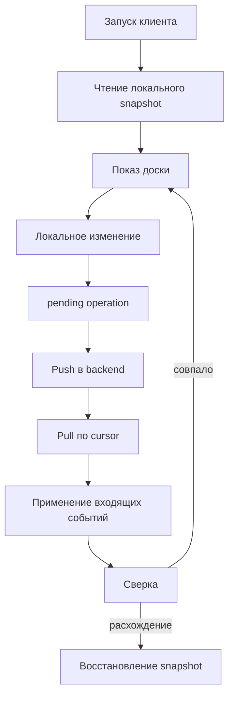

# Жизненный цикл синхронизации v1

## Общая модель

В beta.3 полностью работает локальная очередь основного card-flow и backend
push/pull baseline. Автоматическое применение всего входящего stream к
клиентским entity projections остаётся частичным.

## 1. Запуск

### Тёплый запуск

1. Клиент читает сохранённый snapshot.
2. Сразу показывает доску.
3. В фоне проверяет сеть и обновления.
4. Pending operations не теряются.

### Холодный запуск

1. Локального snapshot нет.
2. При наличии сети клиент загружает данные backend.
3. Сохраняет snapshot и cursor.
4. При отсутствии сети показывает понятное пустое/offline состояние, а не
   притворяется синхронизированным.

## 2. Исходящее изменение

Пользовательское действие сначала фиксируется локально:

1. создаётся операция с `eventId`, `replicaId`, `replicaSeq` и
   `logicalClock`;
2. локальная проекция обновляется;
3. операция попадает в persistent queue;
4. UI показывает `pending`;
5. отправка выполняется сразу либо после восстановления сети.

После локального commit допустимы состояния:

- `pending` — сохранено локально, ещё не принято backend;
- `syncing` — выполняется отправка;
- `synced` — backend принял либо распознал duplicate;
- `failed` — требуется retry или действие пользователя;
- `conflict` — нужен merge/reconciliation.

## 3. Push

Backend:

1. проверяет доступ к workspace;
2. валидирует event;
3. дедуплицирует по `eventId` и `(replicaId, replicaSeq)`;
4. назначает `serverOrder`;
5. сохраняет event и transport outbox в одной транзакции;
6. возвращает результат.

Реакция клиента:

- `accepted` → операция закрывается;
- `duplicate` → считается доставленной;
- `rejected` → не повторяется бесконечно, причина показывается;
- `conflict` → сохраняется для reconciliation;
- временная network/5xx ошибка → retry с задержкой.

## 4. Pull

Клиент запрашивает события после сохранённого cursor:

1. backend возвращает упорядоченный batch;
2. клиент проверяет envelope и workspace;
3. duplicate пропускается;
4. tombstone не позволяет воскресить удалённую сущность старым событием;
5. cursor продвигается только после безопасного применения batch.

Если batch нельзя применить целиком, cursor нельзя перескакивать вперёд.

## 5. Reconciliation

Возможные исходы:

- чистая сходимость — локальное состояние совпало;
- event принят, но локальная проекция устарела — нужен pull/apply;
- операция отвергнута — локальный optimistic результат откатывается либо
  помечается;
- история неполна — требуется snapshot recovery.

Смысловой порядок конфликтов задаётся merge policy, а не временем прихода
пакета. Для параллельных версий используется детерминированное сравнение,
описанное в документации конфликтов.

## 6. Snapshot recovery

Recovery нужен, когда cursor потерян, журнал обрезан, schema несовместима или
проекция не сходится.

Безопасная последовательность:

1. сохранить pending operations отдельно;
2. скачать и проверить новый snapshot;
3. заменить только подтверждённую локальную проекцию;
4. установить cursor snapshot;
5. повторно проиграть совместимые pending operations;
6. показать конфликты, которые нельзя применить автоматически.

Snapshot нельзя считать destructive restore серверной БД.

## 7. Ошибки и retry

Можно повторять:

- timeout;
- временную недоступность сети;
- 429 и подходящие 5xx;
- relay delivery failure.

Нельзя бесконечно повторять:

- 400 с неправильным payload;
- 401/403 без обновления сессии/прав;
- schema mismatch;
- окончательно отвергнутый event.

Retry должен иметь ограничение, backoff и видимый статус.

## 8. Transport foundation

Nostr shadow получает accepted events из транзакционного outbox. Iroh может
доставить тот же signed envelope быстрее. Оба пути дедуплицируются по event ID и
не меняют merge policy.

До coordinator-free режима backend остаётся владельцем авторизации и
`serverOrder`.

## Контрольные точки

- локальная операция переживает перезапуск браузера;
- duplicate push не создаёт второе событие;
- cursor не продвигается после неуспешного apply;
- delete/archive не отменяется старым событием;
- сбой relay не ломает основной CRUD;
- восстановление из Nostr доказывается сравнением итогового snapshot.

