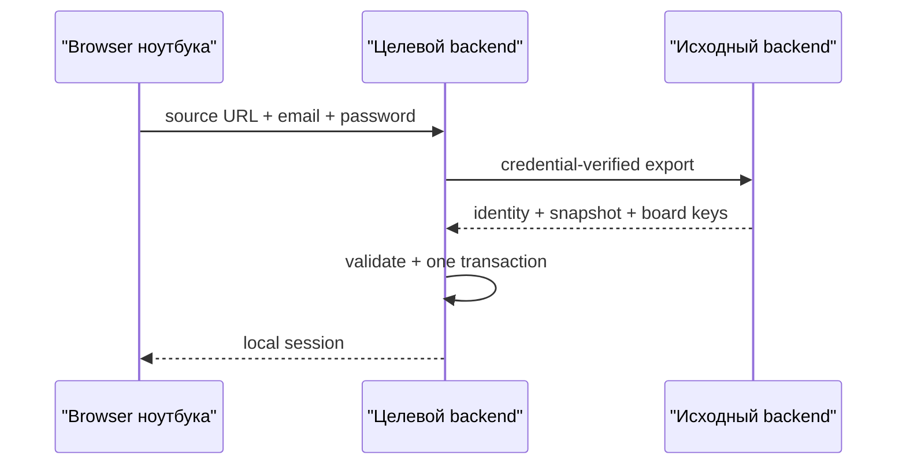

# Связывание двух web-узлов v1

- Статус: реализовано в `v1.0.0-beta.7`
- Дата: 2026-08-01

## Проблема

Каждый self-hosted web-экземпляр содержит собственные PostgreSQL, auth-секреты
и локальный master key транспорта. Поэтому одинаковые email и пароль на двух
независимых установках сами по себе не обозначают один аккаунт:

- уникальность email действует только внутри одной БД;
- обычный вход проверяет только локальную БД открытого узла;
- UUID пользователя, workspace и досок на другом узле неизвестны;
- локально выведенные board keys различаются и не позволяют читать один relay-журнал.

Глобальный реестр email противоречил бы self-hosted модели и всё равно не
передавал бы права и ключи досок. Поэтому web-node link является явным действием
пользователя, а не скрытым глобальным поиском аккаунта.

## Пользовательский поток

1. Оба узла обновлены до beta.7, запущены и доступны друг другу в доверенной
   локальной сети.
2. Целевой узел должен быть чистым: на нём ещё нет аккаунтов и рабочих данных.
3. На экране auth выбирается «Подключить с другого узла».
4. Пользователь вводит LAN-адрес исходного web, email и пароль исходного аккаунта.
5. Целевой backend сам обращается к исходному backend. Браузеру не требуется
   cross-origin доступ и не приходится ослаблять CORS.
6. Исходный узел проверяет пароль и возвращает versioned application snapshot:
   ту же user identity, owned workspaces, доски и per-board relay capabilities.
7. Целевой узел валидирует весь снимок, применяет его одной SQL-транзакцией,
   создаёт локальную сессию и продолжает использовать те же стабильные UUID.



## Что переносится

- UUID, email и display name пользователя;
- настройки аккаунта;
- owned workspaces и owner membership;
- доски, колонки, карточки, метки и связи меток;
- чек-листы и пункты;
- комментарии и оформление досок;
- архивное состояние;
- board key/tag для уже существующих досок.

Не переносятся password hash, refresh/access tokens, сессии, device records,
deployment JWT secret, Nostr signing key и общий backend master key. На целевом
узле пароль хэшируется заново, а сессия и device создаются локально.

## Продолжение синхронизации

Для импортированных досок оба backend используют одну board capability, но
разные локальные `nodeReplicaId`. Это важно: прежнее использование workspace ID
как replica ID создавало коллизии `(replicaId, replicaSeq)` между двумя узлами.

После link relay-журнал продолжает двусторонне переносить карточки и чек-листы.
Android, подключённый к любому из связанных узлов, получает импортированный
board key, а не ошибочный ключ из локального master key этого узла.

## Границы v1

- Переносятся только workspace, которыми пользователь владеет. Чужие shared
  workspace требуют отдельного протокола membership и подписи владельца.
- Полный снимок структуры переносится в момент link. Последующие relay-операции
  beta.7 покрывают карточки и чек-листы; создание новых workspace/досок/колонок,
  метки, комментарии и оформление пока не являются полным CRDT между backend.
- Source URL v1 принимает только `localhost` или прямой IP доверенной локальной
  сети. Автоматический LAN discovery, QR и удалённое pairing не входят в срез.
- При обычном HTTP пароль и snapshot защищены только доверенной локальной сетью.
  Порт нельзя публиковать напрямую в интернет.
- «Выйти везде» и смена пароля пока действуют внутри конкретного deployment,
  потому что session store остаётся локальным.

Эти границы показываются как ограничения, а не маскируются словом P2P. Следующий
протокол должен добавить owner-signed membership epoch и account/workspace
catalogue, чтобы новые структуры обнаруживались через store-and-forward без
повторного прямого link.

## Конфликт с уже созданным локальным аккаунтом

Импорт в занятую БД запрещён. Автоматическое слияние двух пользователей с
одинаковым email опасно: совпадение строки не доказывает общую идентичность и
не определяет, чьи UUID/доски побеждают.

Если на целевом тестовом узле случайно создана ненужная копия, сначала нужно
убедиться, что в ней нет уникальных данных, затем удалить только stack этого
проекта:

```bash
python bootstrap.py reset --yes
```

Команда удаляет локальные контейнеры, БД и сгенерированные secrets данного
bootstrap stack. Исходный узел и его данные она не затрагивает.
