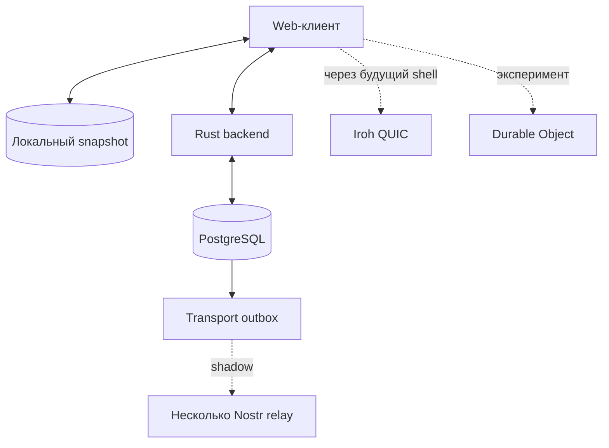
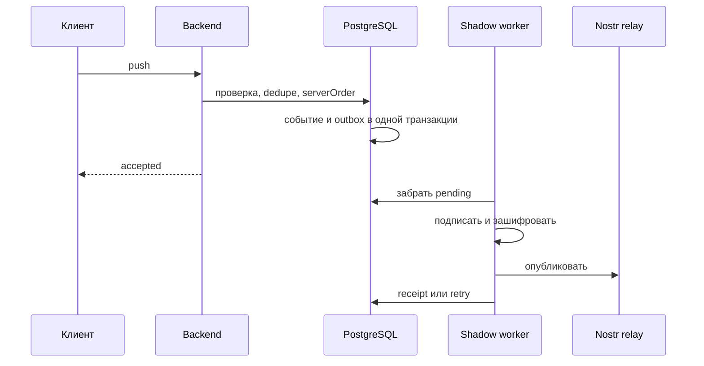

# Бесплатный хостинг и экспериментальные транспорты

Этот документ описывает фактическое состояние пяти реализованных направлений.
Ни одно из них само по себе не делает p2pKanban полностью бессерверным.

## Матрица реализации

| Часть | Что есть в коде | Состояние |
|---|---|---|
| Домашний coordinator | Docker-профиль Rust + PostgreSQL в сети Tailscale | Можно использовать после настройки секретов и Tailscale |
| `sync-core` | События, конверты, валидация, HMAC и порядок merge | Используется backend и transport-адаптерами |
| Nostr shadow | Outbox, retry/dead-letter, шифрование, публикация и recovery CLI | По умолчанию выключен |
| Iroh | Native QUIC endpoint и передача подписанных конвертов | Не подключён к web UI |
| Durable Object | Membership, dedupe, cursor, `serverOrder`, event log и WebSocket | Отдельный совместимый прототип |

## Текущая топология



Сплошные стрелки — обычный путь beta.3. Пунктир — экспериментальные пути.

## 1. Домашний coordinator

Профиль находится в `deploy/home-coordinator`. Он запускает текущий backend и
PostgreSQL на Linux-машине, а наружу показывает API только через Tailscale.
Порт PostgreSQL не публикуется.

Потребуются:

- пароль PostgreSQL;
- случайный JWT secret длиной не менее 32 символов;
- точный CORS origin;
- вход в Tailscale или временный auth key.

Это самый быстрый способ дать нескольким людям доступ к одной доске без
переделки модели прав.

## 2. `sync-core`

Crate `backend/crates/sync-core` содержит:

- `ClientChangeEvent`, `ServerChangeEvent`;
- `SyncEnvelope`, `SignedSyncEnvelope`;
- проверку событий и конвертов;
- HMAC-SHA256 для совместимого общего секрета;
- сравнение версий по
  `(logicalClock, replicaId, eventId)`.

Crate не зависит от Axum, sqlx, PostgreSQL, Nostr и Iroh. HMAC является
временным механизмом совместимости, а не заменой будущих асимметричных подписей
устройств.

## 3. Nostr shadow

### Путь операции



Сбой relay происходит после канонического принятия и не откатывает карточку.

### Настройка

```text
TRANSPORTS__NOSTR__ENABLED=true
TRANSPORTS__NOSTR__RELAYS=wss://relay-a.example,wss://relay-b.example,wss://relay-c.example
TRANSPORTS__NOSTR__SECRET_KEY=<hex-or-nsec-device-key>
TRANSPORTS__NOSTR__MASTER_KEY_BASE64=<32-random-bytes-in-standard-base64>
TRANSPORTS__NOSTR__MIN_RELAY_ACKS=3
TRANSPORTS__NOSTR__BACKFILL_ON_START=true
```

Master key можно создать локально:

```bash
openssl rand -base64 32
```

Для каждого workspace выводятся отдельные ключи шифрования и непрозрачный
`boardTag`. Relay видит автора Nostr event, время и размер ciphertext, но не
UUID workspace и не открытое содержимое.

Состояние outbox доступно через:

```text
GET /api/v1/sync/transports/status
```

Состояния: `pending`, `processing`, `retry`, `delivered`, `dead_letter`.

### Проверка восстановления

1. Включить минимум три тестовых relay и backfill.
2. Дождаться отсутствия `pending`, `processing` и `retry`.
3. Зафиксировать event IDs и количество событий тестового workspace.
4. Выполнить из `backend/`:

   ```bash
   cargo run --bin nostr_recover -- \
     <workspace-uuid> ../recovered-workspace-events.json
   ```

5. Сравнить `eventId` и `serverOrder`.
6. Проиграть конверты в пустую тестовую проекцию.
7. Сравнить итоговый snapshot с исходной доской.

Публикация событий без шагов 5–7 не доказывает восстановимость.

Ограничения: политика хранения relay внешняя; один backend key обслуживает все
настроенные workspace; вложения и полные snapshots не передаются; destructive
restore отсутствует.

## 4. Iroh

Crate `backend/crates/iroh-transport` использует ALPN
`p2p-kanban/sync/1`, принимает endpoint addresses и передаёт один ограниченный
по размеру подписанный конверт на поток.

Adapter не назначает `serverOrder`, не решает конфликты и не хранит сообщения
для offline-peer. Клиент должен запускать прямой и асинхронный пути параллельно,
а затем дедуплицировать по `eventId`.

Текущий Vite-клиент не может быть native Iroh endpoint. Реалистичная следующая
точка интеграции — Tauri/mobile Rust shell либо local sidecar.

## 5. Durable Object coordinator

Проект находится в `edge-coordinator/`.

В SQLite хранятся:

- участники, роли, active flag и epoch;
- dedupe keys и `serverOrder`;
- cursor каждой replica;
- короткие одноразовые WebSocket tickets;
- компактный JSON event log;
- hash board token.

Карточек, колонок и остальных доменных таблиц там нет.

Проверка и развёртывание:

```bash
cd edge-coordinator
npm ci
npm run typecheck
npm test
npx wrangler secret put COORDINATOR_ADMIN_TOKEN
npm run deploy
```

`boardTag` должен быть непрозрачным HMAC-значением, а не UUID workspace.
Обычные HTTP-запросы используют `X-Board-Token` и `X-Actor-Key`. Для WebSocket
сначала запрашивается одноразовый ticket, поэтому board token не попадает в URL.

Текущая граница: владелец board token теоретически может назвать чужой
`actorKey`. До асимметричной подписи каждого события этот сервис нельзя считать
заменой основной авторизации.

## Откат

- домашний профиль: остановить Compose stack;
- Nostr: установить `TRANSPORTS__NOSTR__ENABLED=false`;
- Iroh: не инициализировать adapter;
- edge: направить клиентов обратно на Rust backend.

Во всех случаях канонические доменные данные остаются в PostgreSQL.

