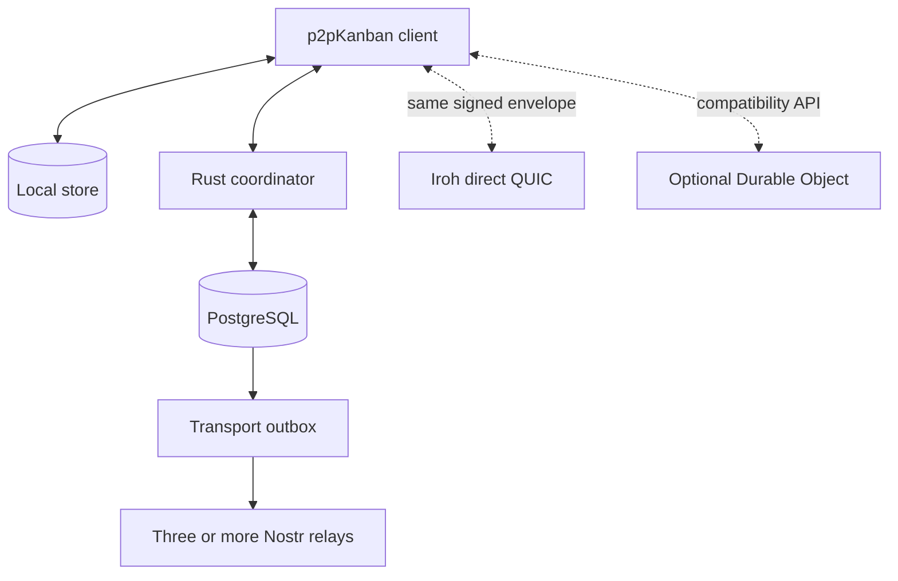
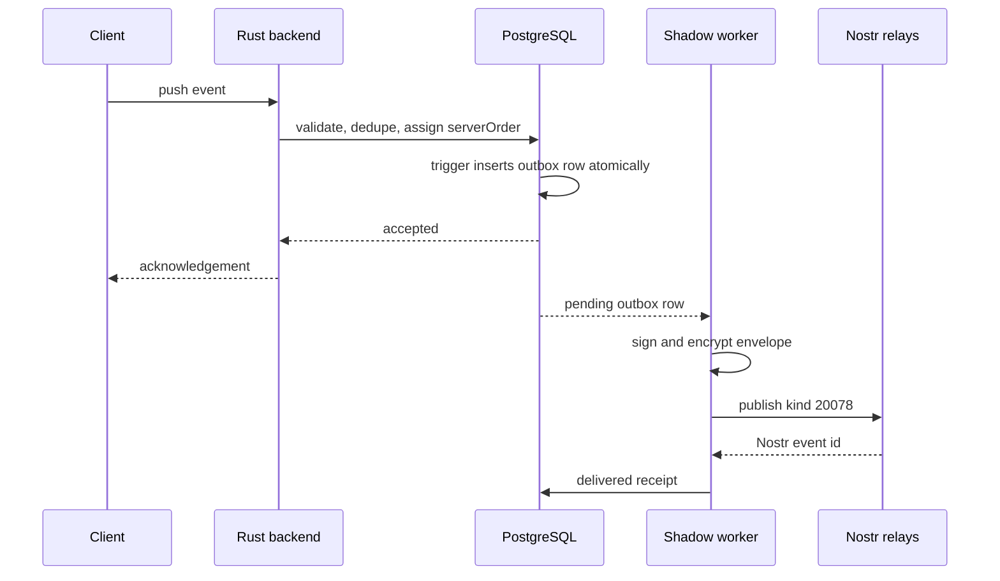

# Free hosting and transport implementation v1

This document is the operational truth for roadmap items 1–5. It separates
usable code from experimental adapters and from the still-unimplemented
coordinator-free mode.

## Implementation matrix

| Item | Code in this patch | Runtime status |
|---|---|---|
| Home coordinator | Docker profile with PostgreSQL, Rust backend and Tailscale network namespace | Usable after local secrets and Tailscale login |
| `sync-core` | Independent crate with event/envelope types, validation, deterministic merge order and authenticated envelopes | Used by backend validation and both transports |
| Nostr shadow mode | Durable PostgreSQL outbox, retry/dead-letter worker, encryption, Nostr signing, three-relay requirement, backfill and recovery CLI | Disabled by default; safe to test beside coordinator |
| Iroh direct path | Iroh 1.x endpoint, framed signed envelopes, multi-peer send and receive | Adapter implemented; not connected to browser UI |
| Durable Object coordinator | SQLite membership, dedupe, cursor, `serverOrder`, event log, one-time WebSocket sessions and hibernatable sockets | Separate deployable compatibility service |

None of these items makes the system coordinator-free.

## Runtime topology



Solid arrows describe the current coordinator-backed path. Dashed arrows are
replaceable transport or compatibility paths.

## 1. Home coordinator

Use `deploy/home-coordinator/compose.yaml` on a Linux laptop or mini-PC.
Detailed commands are in that directory's README.

The important boundary is that PostgreSQL is not published to the LAN or
internet. Backend and Tailscale share one network namespace. Tailscale HTTPS
proxies port `18080`, so production-like secure cookies remain valid.

Required private runtime values:

- PostgreSQL password;
- JWT secret of at least 32 random characters;
- exact static-client CORS origin;
- optional Tailscale auth key.

The Tailscale auth key is only a bootstrap credential. Board data remains in
PostgreSQL and local client stores.

## 2. `sync-core`

The crate is located at `backend/crates/sync-core`.

It contains:

- `ClientChangeEvent` and `ServerChangeEvent`;
- transport-neutral `SyncEnvelope`;
- `SignedSyncEnvelope`;
- event and envelope validation;
- HMAC-SHA256 envelope authentication;
- deterministic version comparison by
  `(logicalClock, replicaId, eventId)`.

It deliberately does not depend on Axum, sqlx, PostgreSQL, Nostr or Iroh.
HMAC authentication is the compatibility mechanism for a shared workspace
secret. It is not a replacement for the future per-device asymmetric
signatures required by coordinator-free membership.

## 3. Nostr shadow transport

### What happens on push



Network relay failure happens after canonical acceptance. It moves the outbox
row through `retry` and eventually `dead_letter`; it does not roll back the
board edit.

### Configuration

The backend defaults are disabled. Set private environment values at runtime:

```text
TRANSPORTS__NOSTR__ENABLED=true
TRANSPORTS__NOSTR__RELAYS=wss://relay-a.example,wss://relay-b.example,wss://relay-c.example
TRANSPORTS__NOSTR__SECRET_KEY=<hex-or-nsec-device-key>
TRANSPORTS__NOSTR__MASTER_KEY_BASE64=<32-random-bytes-in-standard-base64>
TRANSPORTS__NOSTR__MIN_RELAY_ACKS=3
TRANSPORTS__NOSTR__BACKFILL_ON_START=true
```

Generate the master key locally:

```bash
openssl rand -base64 32
```

The master key derives a different encryption/authentication key and opaque
`boardTag` for each workspace. Relays see the Nostr author, time, custom kind
and ciphertext size. They do not see the workspace UUID or event payload.

`backfill_on_start` queues existing workspace events that have no Nostr outbox
row. After the initial test, it may be turned off; new accepted events are
queued by a PostgreSQL trigger in the same transaction as `change_events`.
The worker only marks a row delivered after the configured minimum—three by
default—has acknowledged the Nostr event.

### Observe queue state

Authenticated endpoint:

```text
GET /api/v1/sync/transports/status
```

Relevant states are `pending`, `processing`, `retry`, `delivered` and
`dead_letter`.

### Relay-only recovery gate

1. Enable three test relays and `backfill_on_start`.
2. Wait until no `pending`, `processing` or `retry` rows remain.
3. Record PostgreSQL event count and ordered event IDs for one test workspace.
4. Run from `backend/`:

```bash
cargo run --bin nostr_recover -- \
  <workspace-uuid> ../recovered-workspace-events.json
```

5. Compare unique event IDs and `serverOrder` with PostgreSQL.
6. Replay the recovered envelopes into an empty test projection.
7. Compare the resulting board snapshot with the source snapshot.

Steps 5–7 are the acceptance gate. Merely publishing to relays is not proof of
recoverability.

### Current limits

- Relay retention and event-size policies remain external.
- One backend Nostr author key mirrors all configured workspaces.
- Attachments and full snapshots are not transported.
- Recovery exports envelopes; automatic destructive database restore is
  intentionally absent.

## 4. Iroh direct transport

The crate is `backend/crates/iroh-transport`. It binds an Iroh endpoint with
ALPN `p2p-kanban/sync/1`, accepts endpoint addresses, sends one bounded signed
envelope per unidirectional stream and can receive the same frame.

The adapter does not:

- assign `serverOrder`;
- modify `logicalClock`;
- decide conflicts;
- store messages for an offline peer.

Clients should race Iroh against the asynchronous path and dedupe by event ID.
Failure only changes delivery diagnostics.

The current Vite browser client cannot directly host the native Rust endpoint.
The next practical integration target is a Tauri/mobile Rust shell or a small
local sidecar. Adding an unrelated WebRTC implementation to the browser is not
considered the same Iroh transport.

## 5. Durable Object compatibility coordinator

The project is in `edge-coordinator/`.

### Stored SQLite rows

- `members`: actor key, role, active flag and epoch;
- `events`: dedupe keys, `serverOrder`, actor, epoch and envelope JSON;
- `cursors`: last acknowledged order per actor/replica;
- `sessions`: one-minute single-use WebSocket tickets;
- `meta`: board-token hash and current membership epoch.

Cards and other domain tables are absent by design.

### Deploy

```bash
cd edge-coordinator
npm ci
npx wrangler secret put COORDINATOR_ADMIN_TOKEN
npm run deploy
```

### Provision a board

`boardTag` should be an opaque HMAC-derived value, not a workspace UUID.

```bash
curl -X POST \
  "https://<worker>/v1/boards/<boardTag>/admin/provision" \
  -H "Authorization: Bearer <admin-token>" \
  -H "Content-Type: application/json" \
  -d '{
    "boardToken": "<random-board-token-at-least-32-characters>",
    "ownerKey": "device:<public-key-or-stable-id>",
    "epoch": 1
  }'
```

Add or revoke a member through `/admin/members`. Normal HTTP requests use
`X-Board-Token` and `X-Actor-Key`.

For a browser WebSocket:

1. `POST /sessions` with the two authentication headers.
2. Receive a single-use one-minute ticket.
3. Connect to `/ws?ticket=<ticket>`.
4. Send `{ "type": "push", "event": ... }`.

The board token is therefore not placed in a WebSocket URL.

### Compatibility warning

The edge coordinator verifies membership and a shared board token, but it does
not yet verify a per-event asymmetric device signature. A board-token holder
could claim another active `actorKey`. For that reason this service is a
compatibility experiment, not yet a replacement for the Rust backend's
authorization. Closing this gap belongs to roadmap item 6: owner-signed
membership epochs and device signatures.

## Rollback

- Home profile: stop the compose stack; ordinary development config is
  unchanged.
- Nostr: set `TRANSPORTS__NOSTR__ENABLED=false`. Existing outbox and relay
  events remain for diagnosis.
- Iroh: do not initialize the adapter; canonical sync is unaffected.
- Durable Object: point clients back to the Rust backend. No domain data needs
  to be migrated out because the object never owned domain projections.
