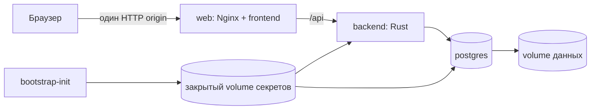

# Zero-config bootstrap v1

## Цель

Обычный локальный запуск p2pKanban не должен требовать ручного создания
PostgreSQL-роли, базы, `.env`, согласования портов backend/frontend или
установки Rust и Node на хост.

Публичный пользовательский путь:

```bash
python bootstrap.py
```

Единственная внешняя зависимость — запущенный Docker с Compose v2.

## Как устроен stack



`postgres` и `backend` не публикуют порты на хост. Наружу выходит только
web-gateway. Поэтому установленный на компьютере PostgreSQL на `5432` не
мешает контейнерному PostgreSQL.

## Первый запуск

1. Wrapper проверяет наличие Docker CLI, Compose v2 и работающего Docker
   daemon.
2. Если `8080` свободен, выбирается он. Иначе выбирается первый свободный порт
   до `8180`.
3. `bootstrap-init` создаёт два случайных секрета в Docker volume:
   пароль PostgreSQL и JWT secret.
4. Официальный PostgreSQL image при первом старте создаёт:
   роль `p2pkanban`, БД `p2pkanban` и постоянный data volume.
5. Backend читает секреты из volume, собирает `DATABASE__URL` только внутри
   контейнера, подключается к БД и применяет миграции.
6. Frontend собирается с относительным API URL `/api/v1`.
7. Nginx отдаёт SPA и проксирует `/api` во внутренний backend.
8. Wrapper ждёт `/healthz`, сохраняет только несекретные сведения о stack в
   `.dev-bootstrap/container-stack.json` и открывает браузер.

Никакие `.env` не создаются. Секреты не попадают в Git, shell history, Compose
manifest или bootstrap state.

## Повторный запуск и остановка

```bash
python bootstrap.py
python bootstrap.py status
python bootstrap.py logs
python bootstrap.py logs --follow
python bootstrap.py stop
```

Повторный `start` использует прежний порт, БД и секреты. `stop` удаляет
контейнеры и сеть, но сохраняет оба named volume.

Обновление кода выполняется отдельно:

```bash
python bootstrap.py update
```

Bootstrap собирает новые backend/web images рядом с работающими, создаёт
`pg_dump`, переключает их на прежние volumes и автоматически возвращает старые
images при ошибке readiness. Подробности:
[`application-update-strategy-v1.md`](application-update-strategy-v1.md).

Предыдущий код можно вернуть без автоматического восстановления БД:

```bash
python bootstrap.py rollback
```

Полный сброс намеренно требует явного подтверждения:

```bash
python bootstrap.py reset --yes
```

Он удаляет локальную БД и секреты. Следующий запуск создаст чистую установку.

## Режим локальной сети

По умолчанию web-порт привязан к `127.0.0.1` и доступен только на текущем
компьютере.

Для доверенной локальной сети:

```bash
python bootstrap.py start --listen lan
```

Это обычный HTTP без публичного TLS. Его нельзя пробрасывать напрямую в
интернет. Для доступа через интернет применяется отдельный
`deploy/home-coordinator` с Tailscale либо будущий transport stack.

## Запуск без Python-wrapper

Compose stack сам создаёт секреты и БД, поэтому его можно поднять напрямую:

```bash
docker compose \
  --project-name p2pkanban-bootstrap \
  --file deploy/bootstrap/compose.yaml \
  up --detach --build
```

В таком режиме используется фиксированный `127.0.0.1:8080`, не выполняется
автопоиск свободного порта и браузер не открывается.

## Границы

- Это локальный/self-host bootstrap, а не coordinator-free P2P-режим.
- Nostr и Iroh отключены: их ключи и выбор релеев не должны неявно создаваться
  для пользователя.
- Внешний PostgreSQL не подхватывается и не изменяется.
- Существующий host-native `tools/devbootstrap.py up` остаётся разработческим
  путём для release gates и точечной диагностики.
- Docker volumes являются локальным состоянием. Для важных досок всё ещё нужен
  экспорт/backup.

## Диагностика

| Симптом | Что делает bootstrap |
|---|---|
| Docker CLI отсутствует | Останавливается с одной инструкцией установить Docker |
| Docker Desktop закрыт | Останавливается до сборки и просит запустить daemon |
| `8080` занят | Автоматически выбирает следующий свободный порт |
| PostgreSQL уже работает на хосте | Игнорирует его; `5432` контейнера наружу не публикуется |
| Первый build упал | Показывает `compose ps` и последние логи |
| Повторный запуск | Сохраняет прежнюю БД, секреты и web-порт |
| Обновление не собралось | Оставляет работающие контейнеры без изменений |
| Новая версия не прошла readiness | Возвращает сохранённые старые images |
| Нужна предыдущая версия кода | `rollback` создаёт backup и переключает images без удаления volumes |
| Нужна чистая установка | Только явный `reset --yes` удаляет volumes |
