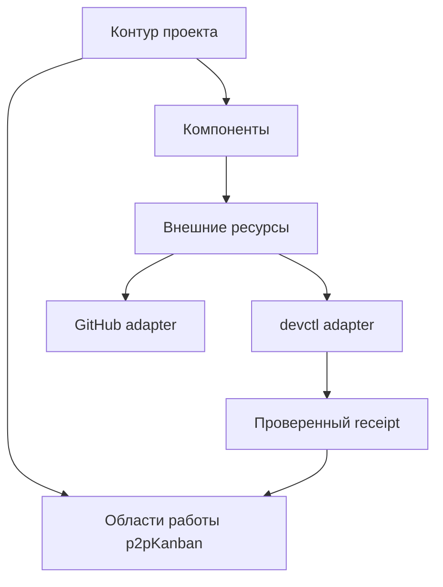

# Концепция интеграции проектов с GitHub и devctl

- Статус: идейный документ, без обещания готовой интеграции
- Версия схемы: draft 1
- Актуально на: 2026-07-29

## Короткий вывод

Проект нельзя приравнивать ни к доске, ни к GitHub-репозиторию. Для интеграций
нужна отдельная сущность **контур проекта** (`project binding`): она связывает
произвольную область работы в p2pKanban с нулём, одним или несколькими внешними
ресурсами.

Такой контур может описывать:

- маленькую задачу, представленную одной карточкой с чек-листом;
- обычный проект, занимающий одну доску и один репозиторий;
- экосистему из нескольких досок, репозиториев, документации и иных ресурсов;
- проект без кода и вообще без GitHub.

GitHub и devctl при этом являются сменными провайдерами вокруг нейтрального
ядра интеграций.

## Почему доска и репозиторий не подходят на роль проекта

| Сценарий | Почему прямое соответствие ломается |
|---|---|
| Маленькая работа | Целая доска избыточна; достаточно карточки и чек-листа |
| Монорепозиторий с несколькими продуктами | Один repository содержит несколько смысловых проектов |
| Экосистема | Один проект использует несколько repository и досок |
| Некодовый проект | GitHub может хранить документы или ассеты, но не определяет смысл работы |
| Работа без GitHub | Проект всё равно должен существовать и развиваться |

Контур проекта задаёт смысловую границу, а доски, карточки и внешние ресурсы
становятся его компонентами.

## Модель

### `Project`

Стабильная сущность с UUID, названием и владельцем внутри workspace. Она не
обязана иметь отдельную таблицу задач: вместо этого хранит ссылки на уже
существующие области p2pKanban.

### `WorkScope`

Область работы внутри p2pKanban:

- `workspace`;
- `board`;
- `card`;
- `checklist`;
- при необходимости — конкретный `checklistItem`.

Один scope выбирается основным, остальные могут быть дополнительными.

### `Component`

Смысловая часть проекта: Android-клиент, web, документация, маркетинг,
исследование или любой другой участок. Компонент может иметь собственный
`WorkScope` и несколько внешних ресурсов.

### `ExternalResource`

Provider-neutral ссылка:

- provider: `github`, `devctl`, будущий `gitlab`, `notion`, `filesystem` и т. д.;
- kind: `repository`, `issue`, `pull_request`, `release`, `patch_stream`,
  `document` или расширяемое значение;
- locator: непрозрачный идентификатор провайдера;
- роль ресурса в проекте, не зависящая от наличия кода.

### `WorkItemRef`

Стабильная ссылка на карточку, чек-лист или пункт. Имена и порядковые номера не
используются как идентификаторы: после переименования связь должна сохраниться.

### `EvidenceReceipt`

Неизменяемое подтверждение результата внешнего инструмента: какой патч
применён, какой commit получен, какие проверки прошли и к каким `WorkItemRef`
это относится. Receipt не заменяет задачу и не переписывает её молча.

## Масштабирование одной модели

| Масштаб | Основной `WorkScope` | Компоненты и ресурсы |
|---|---|---|
| Один чек-лист | `card` или `checklist` | могут отсутствовать |
| Обычный проект | `board` | один GitHub repository |
| Большой продукт | `workspace` | несколько досок и repository |
| Экосистема | отдельный `Project` в workspace | компоненты из нескольких workspace и провайдеров по явным правам |

Для первой реализации достаточно разрешить scope внутри одного workspace.
Межпространственные контуры можно добавить позже без изменения базовой модели.

## Общая схема



Главное направление данных: внешние адаптеры создают нормализованные события
и receipts, а изменение доменных сущностей выполняет обычный application
service p2pKanban с проверкой прав.

## Локальный каталог `.p2pkanban`

Каноническое имя — `.p2pkanban/` в нижнем регистре. Каталог необязателен:
интеграция должна работать и для ресурсов, в которые нельзя добавить файл.

Минимальный `.p2pkanban/project.json`:

```json
{
  "schemaVersion": 1,
  "projectId": "018f4e16-7a52-7a43-b6f8-a287a5286f4f",
  "componentId": "018f4e17-3669-70bf-8f81-73268af9ef66",
  "resource": {
    "provider": "github",
    "kind": "repository",
    "locator": "owner/repository"
  },
  "defaultWorkScope": {
    "kind": "board",
    "id": "018f4e18-b298-7ab7-aa8d-2aef9e5cb60b"
  }
}
```

В файл не попадают access tokens, relay-ключи, пароли и иные секреты. Он
содержит только публичные идентификаторы связи. Сервер остаётся каноническим
хранилищем самого контура и проверяет, что manifest ссылается на существующие
сущности.

Папка удобнее одиночного файла: позже рядом можно добавить versioned mapping,
локальные шаблоны и JSON Schema без переименования корневого механизма.

## Расширение manifest devctl

Патч devctl может объявлять намерение связать результат с задачами:

```json
{
  "integrations": {
    "p2pKanban": {
      "schemaVersion": 1,
      "projectId": "018f4e16-7a52-7a43-b6f8-a287a5286f4f",
      "workItems": [
        {
          "ref": "card:018f4e1a-5764-798c-8d60-5747f5e921d6",
          "requestedTransition": "complete"
        },
        {
          "ref": "checklistItem:018f4e1b-26f2-7271-8841-b8a594eac84d",
          "requestedTransition": "complete"
        }
      ]
    }
  }
}
```

Запись в исходном manifest — только заявление автора патча. Она не должна
автоматически закрывать задачи до успешного применения.

После `apply -> checks -> commit` devctl формирует receipt:

```json
{
  "schemaVersion": 1,
  "receiptId": "018f4e1c-c599-724a-98a7-c37c1bf6cb22",
  "patchId": "2026-07-29-android-core-crud",
  "patchSha256": "sha256:...",
  "result": "applied",
  "commit": "5012c20...",
  "checks": [
    { "name": "typecheck", "status": "passed" },
    { "name": "tests", "status": "passed" }
  ],
  "workItems": [
    {
      "ref": "card:018f4e1a-5764-798c-8d60-5747f5e921d6",
      "transition": "complete"
    }
  ],
  "appliedAt": "2026-07-29T22:00:00Z"
}
```

p2pKanban принимает receipt идемпотентно по `receiptId`, сохраняет evidence и
применяет разрешённые переходы. Повторная доставка не создаёт вторую запись и
не переключает задачу ещё раз.

## GitHub как первый внешний провайдер

GitHub adapter не должен предполагать, что repository содержит код. Для
интеграционного ядра это просто внешний ресурс с доступными capabilities.

Первый полезный срез:

1. привязать один или несколько repository к компоненту;
2. показать ссылку, default branch и доступность ресурса;
3. импортировать выбранные issues как связанные карточки без автоматического
   двустороннего редактирования;
4. принимать подписанные webhook-события или выполнять polling;
5. хранить явную таблицу соответствий внешнего объекта и `WorkItemRef`.

Полевая политика задаётся для каждой связи:

| Поле | Возможные владельцы |
|---|---|
| Заголовок | p2pKanban, GitHub или ручной merge |
| Статус | p2pKanban, GitHub или направленное отображение |
| Метки | независимые либо mapped по таблице |
| Описание | один выбранный источник |
| Evidence | append-only, не редактирует внешний объект |

Автоматическое сопоставление по похожему названию запрещено. Связь создаётся
по стабильным ID или явным действием пользователя.

## Расширяемость провайдеров

Каждый adapter объявляет manifest возможностей:

```text
provider key
resource kinds
auth modes
read capabilities
write capabilities
webhook/polling capabilities
field mapping policies
rate-limit hints
```

Integration core знает только этот контракт, normalized events и commands.
GitHub DTO, заголовки webhook и формат devctl receipt остаются внутри
соответствующих adapters.

## Безопасность

- Секреты никогда не хранятся в `.p2pkanban` или devctl-патче.
- Доступ к GitHub выдаётся с минимальными permissions и хранится сервером либо
  локальным credential broker.
- Receipt содержит hash патча и фактический commit; неподтверждённый manifest
  не считается evidence.
- Любое изменение задач проходит текущую авторизацию p2pKanban.
- Внешняя ошибка не блокирует основной CRUD и local-first очередь.
- Двусторонняя синхронизация включается только с явной политикой конфликтов.

## Этапы реализации

### Этап 0 — текущий документ

Зафиксировать модель, имена и границы. Пользовательской интеграции ещё нет.

### Этап 1 — read-only project bindings

Добавить `Project`, `Component`, `ExternalResource`, API и экран привязок без
токенов и фоновой синхронизации.

### Этап 2 — devctl receipts

Опубликовать JSON Schema расширения manifest и receipt, добавить preview и
идемпотентный ingestion. Сначала поддержать только evidence; автоматический
переход задач включать отдельной настройкой.

### Этап 3 — GitHub read/import

Подключить credentials, чтение repository/issues и явное создание mappings.

### Этап 4 — направленная синхронизация

Добавить webhooks/polling, outbox, retries и выбранную политику владельца полей.

### Этап 5 — другие провайдеры

Проверить универсальность вторым адаптером. Если для него требуется менять
core-сущности GitHub-специфичным образом, граница спроектирована неверно.

## Решения, которые пока намеренно не принимаются

- GitHub App, OAuth или PAT как окончательный auth-механизм;
- где именно отображать Project в навигации;
- должна ли задача закрываться автоматически по receipt;
- формат межпространственных прав;
- двустороннее редактирование issues в первом релизе.

Эти решения зависят от пользовательского прототипа и threat model, но не меняют
базовую модель «контур проекта — компоненты — внешние ресурсы — evidence».
